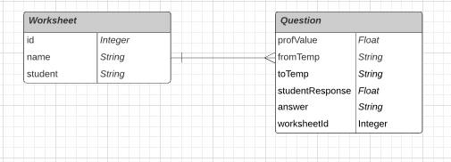

# temperature_conversion_api

Validate temperature conversions using a worksheet question node.js based API

   This implementation was created using **node.js**. After cloning  the repo run the following commands to get all dependencies. 

	
    cd temperature_conversion_api
    npm install

To run 

    npm start

The program uses a `sqlite` database so data can persist if you'd like to reset the data everytime you run it change the following line on `src/server.js` file.

    const  eraseDatabaseOnSync = true;
## Usage
This API consists of a single endpoint `/evaluation`  that allows `GET` and `POST` methods. 

After running the program, you can send requests using POSTMAN. If you're running the program locally the `3000` port  has been assigned to receive the requests.

A `POST` request would go as follows: 

    http://localhost:3000/evaluation

The URI takes a `JSON` object as the body to `POST` and store the students worksheet. An example of the `JSON`object required is as follows.

    {"name":"WS1",
    "student": "Aaron",
    "questions": [
	    {"fromTemp": "c",
	    "toTemp": "f",
	    "profValue": 0,
	    "studentResponse": 32},
	    {"fromTemp": "k",
	    "toTemp": "f",
	    "profValue": 0,
	    "studentResponse": 32.33}
	    ]
	}

Each worksheet has a name a student and multiple questions assigned to it.

To simplify conversion the temperature type values have been mapped to a single lower case letter.

    f = Fahrenheit,
    c = Celsius,
    k = Kelvin,
    r = Rankine
    

To request data from the API the `GET` request is as follows:

    http://localhost:3000/evaluation/:worksheetname/studentname

The API handles capitalization in the background so a request like:

    http://localhost:3000/evaluation/WS1/Aaron
would be the same as 

    http://localhost:3000/evaluation/ws1/aaron

The response includes the `question` objects for the requested student's worksheet.
A more tabular  and beautified response can be seen on the server terminal.

## Data Model

   SQLite database model.

